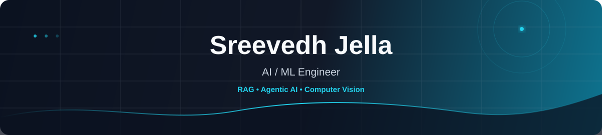

 

&nbsp;

  

 

> **I build AI systems end-to-end — from retrieval and model inference to APIs, evaluation, and user-facing products.**

---

## 🧭 What I Work On

<table>
<tr>
<td width="50%" valign="top">

### 🔎 RAG & Retrieval

Building retrieval pipelines that combine different search strategies instead of relying on a single embedding lookup.

- Dense retrieval
- BM25
- RRF / hybrid search
- Reranking
- Retrieval evaluation

</td>
<td width="50%" valign="top">

### 🤖 Agentic AI

Designing workflows where specialized components can reason, route tasks, use tools, and validate generated results.

- LangGraph workflows
- Query routing
- Multi-agent systems
- Tool use
- Structured generation

</td>
</tr>

<tr>
<td width="50%" valign="top">

### 👁️ Computer Vision

Working on practical multimodal and vision applications with an emphasis on useful outputs and explainability.

- Image analysis
- Segmentation
- OCR
- Grad-CAM
- OpenCV

</td>
<td width="50%" valign="top">

### ⚙️ AI Application Engineering

Turning models into applications rather than keeping them as isolated notebooks.

- FastAPI / Flask
- React / Next.js
- Streamlit
- PostgreSQL / Supabase
- Docker & Git

</td>
</tr>
</table>

---

## 🚀 Featured Project

### [Codebase Copilot](https://github.com/djcode0718/Codebase-Copilot)

**Repository Intelligence Platform**

An AI workspace that understands software repositories and helps answer **code-level, architectural, security, and repository-analysis questions**.

<table>
<tr>
<td width="50%" valign="top">

**🔎 Hybrid Retrieval**

Dense retrieval + BM25 + Reciprocal Rank Fusion, followed by reranking for improved relevance.

**🧠 Intelligent Routing**

Routes questions to the appropriate retrieval or deeper repository-analysis path.

**🏗️ Repository Intelligence**

Architecture discovery, dependency analysis, security review, health scoring, onboarding and impact analysis.

</td>
<td width="50%" valign="top">

**⚡ Production Stack**

FastAPI + Next.js + Supabase with SSE streaming and JWT authentication.

**🤖 Multi-LLM**

Supports Ollama, Groq and Gemini.

**📊 Evaluation**

Hit Rate **0.80+** · MRR **0.60+** · Relevancy **0.90+** · Routing Accuracy **1.00** · Retrieval ~**0.1s**

</td>
</tr>
</table>

**Testing:** 238 test functions across 13 test files.

`Python` `LlamaIndex` `BM25` `FAISS` `ChromaDB` `ColBERT` `FastAPI` `Next.js` `Supabase`

---

## 🧩 Selected Projects

<table>
<tr>
<td width="50%" valign="top">

### 🧠 [NeuroTriage](https://github.com/djcode0718/NeuroVera)

Research prototype for brain-MRI analysis combining computer vision, **Grad-CAM explainability, case retrieval and LangGraph-based multi-agent reporting**.

A critic agent checks the generated draft against model evidence and can route the workflow back for revision.

 

`Python` `LangGraph` `FastAPI` `React`

</td>

<td width="50%" valign="top">

### 🤟 [Sound2Sign](https://github.com/djcode0718/Sound2Sign)

Converts English text or speech into **Indian Sign Language animations** using gloss generation, motion modeling, GRU-based transitions, cosine interpolation and facial-expression rendering.

 

`Python` `Mistral` `GRU` `MediaPipe` `Streamlit`

</td>
</tr>

<tr>
<td width="50%" valign="top">

### 🧪 [FedSegX](https://github.com/djcode0718/FedSegX)

Federated-learning study for **cross-domain image segmentation**, using PVTv2 with FedAvg/FedProx while keeping raw images on their respective clients.

 

`Python` `PyTorch` `PVTv2` `Federated Learning`

</td>

<td width="50%" valign="top">

### 🎬 [UGC Ad Studio](https://github.com/djcode0718/UGC-Ad-Studio)

Generative-AI workflow that turns a product brief into **hooks, short-form scripts, storyboards, captions, CTAs and cinematic image prompts**.

 

`TypeScript` `Next.js 14` `Gemini` `Tailwind CSS` `Framer Motion`

</td>
</tr>
</table>

---

## 🛠️ Tech Stack

### AI / ML

  

  

### Development

  

### Data & Infrastructure

---

## 📌 Engineering Snapshot

<table>
<tr>
<td align="center" width="25%">

**RAG**

Hybrid Retrieval

</td>
<td align="center" width="25%">

**AI**

Agentic Workflows

</td>
<td align="center" width="25%">

**VISION**

Multimodal AI

</td>
<td align="center" width="25%">

**BUILD**

Full-Stack AI

</td>
</tr>
</table>

---

## 📈 GitHub Activity

---

## 🐍 Contribution Snake

<picture>
  <source media="(prefers-color-scheme: dark)" srcset="https://raw.githubusercontent.com/djcode0718/djcode0718/output/snake-dark.svg" />
  <source media="(prefers-color-scheme: light)" srcset="https://raw.githubusercontent.com/djcode0718/djcode0718/output/snake-light.svg" />
  
</picture>

---

### ⚡ Building systems, not just demos.

`retrieval` → `reasoning` → `evaluation` → `product`

 

